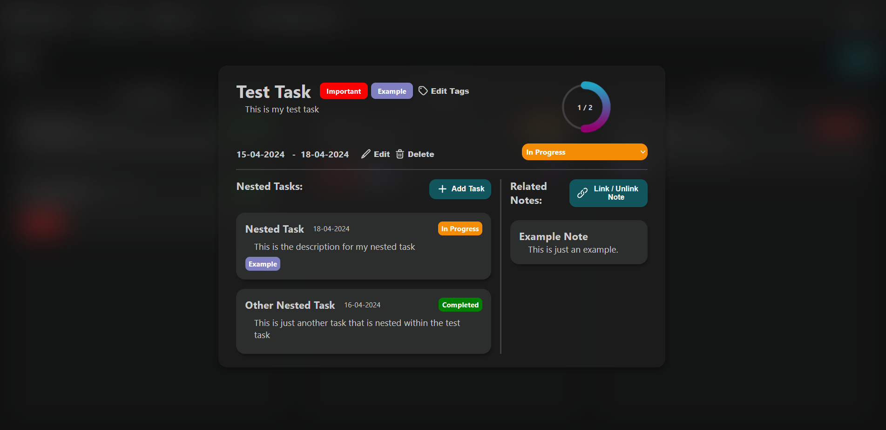
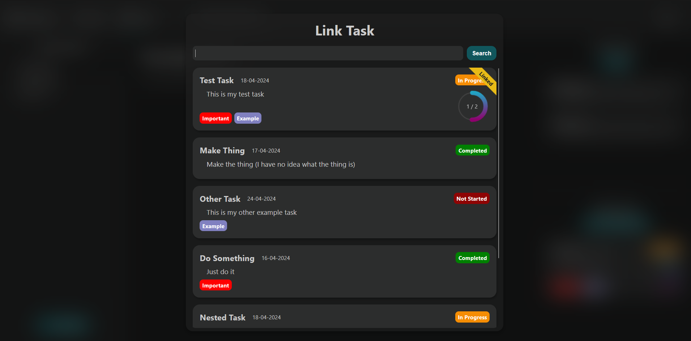
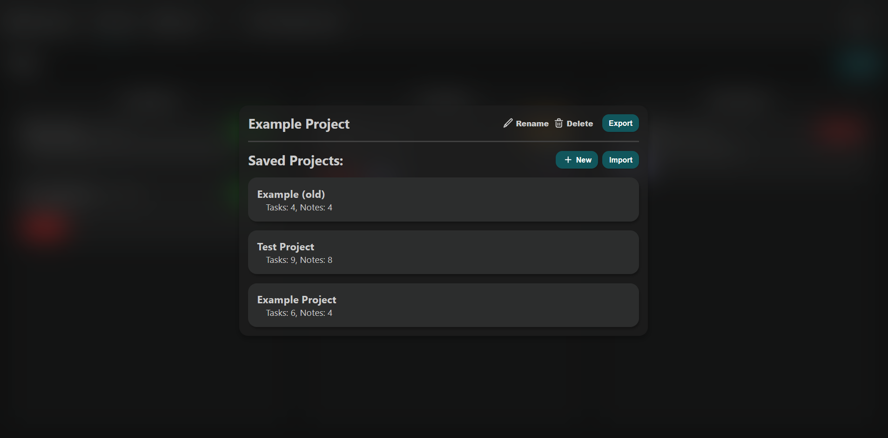

# Planning and management app
### Outline
This application is a single-page web application for planning and managing a project. It aims to bring together planning and tracking in an interconnected way.
### Guidelines
As per the requirements for this project. This is a single page web-application built using only HTML, CSS, and JavaScript. No frameworks or additional dependencies were used in the creation of this project.

# Features
### Tasks and notes
Both tasks and notes follow a tree hierarchy structure where, for example, sub-tasks can be nested within a task and so on.

Tasks are intended to track individual aspects of a project, they contain information such as a title, description, start and end date, tags, etc. Tasks can be created and viewed on the tasks tab where they are sorted into 3 groups depending on their status: not started, in progress, and completed. 

Notes are more simple as they consist of a title and content. These notes can be used for the planning aspect of the project. They can be created and viewed on the notes tab.

### Dashboard
The dashboard tab gives an at-a-glance summary of tasks and progress throughout the week. This includes a progress graph showing what tasks have been started and completed for each day of the week; A list of tasks that end soon; And a calendar showing deadlines for active tasks in the week.

### Linking tasks notes
This app also allows you to link tasks and notes together, this allows tasks and notes that might be related to be joined together so they can quickly be accessed from one-another.

### Easy management of projects
Projects can easily be switched between in the project menu, as well as exported and imported to and from a JSON file.
